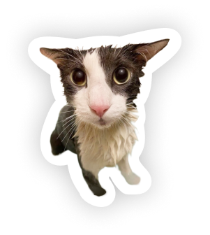

## soggyquarium

Quick single page demo I made trying to prove a point to a friend about performance, and also showing said friend that having flying objects is possible without canvases.

- **2D Canvas API demo: <https://einefoxtail.github.io/soggyquarium/>**
- CSS Transforms demo: <https://einefoxtail.github.io/soggyquarium/index.dom.html>

The CSS Transforms one is the first version I made. I then made the latter out of curiosity. Thankfully I didn't have to change much code. I recommend visiting the two, especially the latter. And even study the code if you're that curious! I'm always open to advices and criticism.

These pages have been made with my bare paws. Owa!
